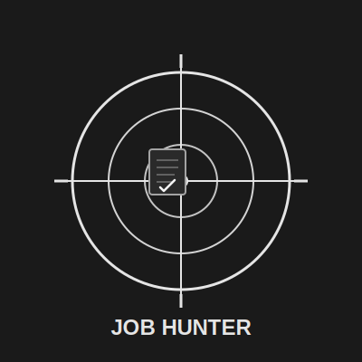
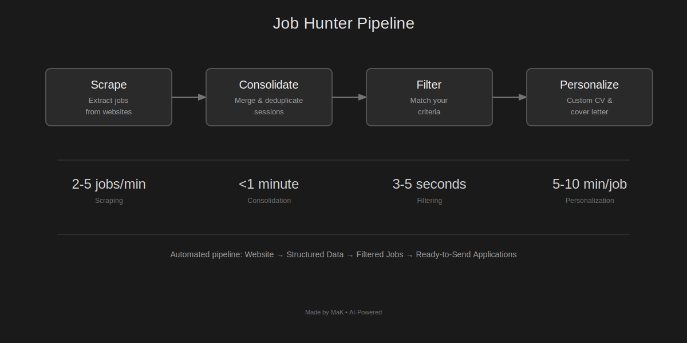
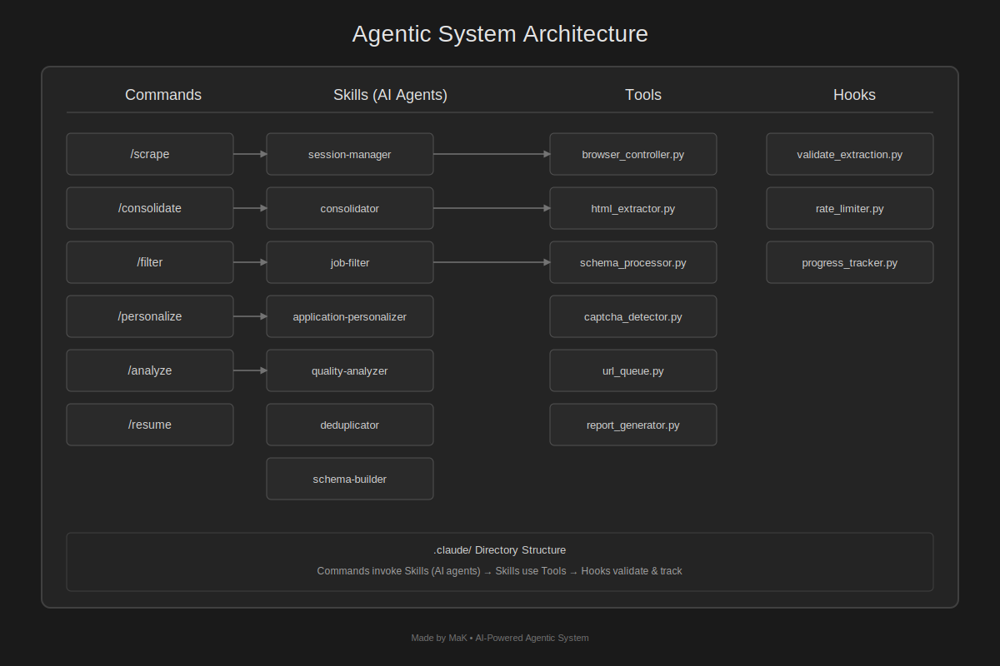

# Job Hunter



AI-powered job scraping, filtering, and application automation system built with Claude Code.

## Overview

Complete pipeline from job discovery to personalized applications:



## Quick Start

```bash
# 1. Install
pip install -r requirements.txt

# 2. Start Chrome with remote debugging
/Applications/Google\ Chrome.app/Contents/MacOS/Google\ Chrome --remote-debugging-port=9222

# 3. Run the pipeline
/scrape              # Extract jobs from website
/consolidate         # Merge sessions, remove duplicates
/filter              # Find jobs matching your criteria
/personalize         # Create custom CV & cover letter for each job
```

## Pipeline

### 1. Scraping (`/scrape`)

Extract job listings from any website:
- Classifies pages (job detail vs. job list)
- Extracts structured data (title, company, salary, requirements, etc.)
- Handles pagination automatically
- Saves HTML for debugging
- Checkpoints every 10 jobs

**Output:** `output/session_[ID]/jobs/*.json`

### 2. Consolidation (`/consolidate`)

Merge multiple scraping sessions:
- Combines all session data
- Removes duplicates (URL + 80% title similarity)
- Generates statistics

**Output:** `output/database/jobs_master.json`

### 3. Filtering (`/filter`)

Find jobs matching your criteria:
- Keywords (fuzzy matching)
- Location type (remote/hybrid/onsite)
- Salary range (normalized to annual)
- Experience level
- Job type (full-time/part-time/contract)
- Cities, company names
- Required skills (AI-powered)

**Filtering Strategies:**
- **Deterministic** (exact match): job type, experience, location, dates
- **Fuzzy** (pattern match): keywords, salary, cities, company
- **AI** (semantic): required skills, relevance

**Output:** `output/database/jobs_filtered.json`

### 4. Personalization (`/personalize`)

Create tailored application documents:

**For each job (one at a time):**
1. Research company (website, mission, values, tech stack, recent news)
2. Personalize CV template (emphasize relevant experience)
3. Personalize cover letter (show genuine interest, cultural fit)
4. Save application package

**Your Templates:**
- `user_docs/cv_template.md` - Your master CV
- `user_docs/cover_letter_template.md` - Your master cover letter

**Output:** `applications/[job_id]_[company]/` (cv.md, cover_letter.md, company_research.json)

## Project Structure



```
job-hunter/
├── .claude/
│   ├── commands/       # /scrape, /filter, /personalize
│   ├── skills/         # AI agents (session-manager, job-filter, etc.)
│   ├── hooks/          # Validation, rate limiting, progress tracking
│   └── tools/          # Browser control, extraction, CAPTCHA detection
├── config/
│   └── extraction_schema.json   # What data to extract
├── user_docs/
│   ├── cv_template.md           # Your CV (with EDITABLE sections)
│   └── cover_letter_template.md # Your cover letter (with EDITABLE sections)
├── scripts/
│   ├── filter_jobs.py           # Filtering engine
│   ├── consolidate_sessions.py  # Session merger
│   └── init_tracker.py          # Application tracker
├── output/
│   ├── session_[ID]/            # Scraping sessions
│   ├── database/                # Master & filtered databases
│   └── reports/                 # Quality & filter reports
└── applications/                # Personalized docs per job
    └── [job_id]_[company]/
        ├── cv.md
        ├── cover_letter.md
        └── company_research.json
```

## Commands

| Command | Description | Output |
|---------|-------------|--------|
| `/scrape` | Scrape jobs from website | `output/session_[ID]/` |
| `/consolidate` | Merge sessions, dedupe | `output/database/jobs_master.json` |
| `/filter` | Filter jobs by criteria | `output/database/jobs_filtered.json` |
| `/personalize` | Create custom applications | `applications/[job_id]_[company]/` |
| `/analyze` | Quality analysis report | `output/reports/quality_report_[ID].md` |

## Database Examples

### Scraped Job
```json
{
  "job": {
    "id": "12345",
    "url": "https://example-jobs.com/positions/12345",
    "title": { "value": "Senior Backend Developer", "confidence": 100 },
    "company": { "value": "TechCorp Solutions Inc.", "confidence": 100 },
    "location": { "city": "San Francisco", "country": "USA", "type": "hybrid" },
    "salary": { "min": 120000, "max": 160000, "currency": "USD", "period": "annual" },
    "requirements": ["5+ years Node.js", "Docker", "AWS"],
    "responsibilities": ["Design APIs", "Mentor juniors"]
  }
}
```

### Filtered Job
```json
{
  "id": "12345",
  "title": "Senior Backend Developer",
  "company": "TechCorp Solutions Inc.",
  "location": "San Francisco, CA",
  "filter_match": {
    "criteria_met": ["job_title", "location_type", "salary_range"],
    "match_score": 100
  }
}
```

### Personalized Application
```
applications/12345_TechCorp_Solutions_Inc/
├── cv.md                      # Your CV tailored for TechCorp
├── cover_letter.md            # Cover letter mentioning their mission, tech stack
└── company_research.json      # Mission, values, products, recent news
```

## Configuration

### Extraction Schema (`config/extraction_schema.json`)

Define what data to extract:

```json
{
  "extraction_schema": {
    "required": {
      "title": { "type": "string", "min_confidence": 80 },
      "company": { "type": "string", "min_confidence": 70 },
      "location": { "type": "string", "min_confidence": 70 }
    },
    "high_priority": {
      "salary": { "type": "object", "min_confidence": 60 },
      "description": { "type": "string", "min_confidence": 70 }
    },
    "medium_priority": {
      "requirements": { "type": "array" },
      "responsibilities": { "type": "array" },
      "jobType": { "type": "string" }
    }
  }
}
```

### CV Template (`user_docs/cv_template.md`)

Add your experience with marked EDITABLE sections:

```markdown
<!-- EDITABLE: professional_summary -->
<!-- INSTRUCTIONS: Emphasize skills matching the job -->
Your professional summary here
<!-- END EDITABLE -->
```

The personalization agent edits only marked sections while preserving structure.

## Usage Examples

### Example 1: Scrape → Filter → Personalize

```bash
# Scrape jobs
/scrape
> URL: https://example-jobs.com/
> Result: 450 jobs extracted

# Consolidate
/consolidate
> 450 jobs → 380 unique (70 duplicates removed)

# Filter for remote senior roles
/filter
> Keywords: "backend developer"
> Location: Remote
> Experience: Senior
> Salary: $120k - $180k USD
> Result: 47 matches

# Personalize applications
/personalize
> Processing 47 jobs (one at a time)
> ETA: 4-6 hours
> Result: 47 application packages ready
```

### Example 2: Resume Interrupted Session

```bash
/resume
> Last checkpoint: Job 45/120
> Resuming from job 46...
```

## Features

### Smart Extraction
- AI-powered data extraction
- Confidence scoring (0-100%)
- Multi-language support (EN, DE, FR, etc.)
- Handles missing data gracefully

### Quality Tracking
- Completeness percentage
- Quality grades (A-F)
- Field-level statistics
- Extraction method tracking

### Filtering
- **Speed:** 3-5 seconds for 600 jobs
- **Precision:** Deterministic + fuzzy + AI
- **Transparency:** Shows which filters matched/failed

### Personalization
- **Depth:** 60% research, 40% writing
- **Quality:** High/medium/low research scoring
- **Speed:** 5-10 minutes per job
- **Safety:** One job at a time, no batching, no script generation

## Data Flow

```
Website (HTML)
    ↓
[Scraping Pipeline]
    ↓ structured JSON
Session Jobs (output/session_[ID]/)
    ↓
[Consolidation]
    ↓ deduplicated
Master Database (output/database/jobs_master.json)
    ↓
[Filtering]
    ↓ matched jobs
Filtered Database (output/database/jobs_filtered.json)
    ↓
[Personalization]
    ↓ for each job: research + personalize
Application Packages (applications/[job_id]_[company]/)
```

## Performance

| Stage | Speed | Notes |
|-------|-------|-------|
| Scraping | 2-5 jobs/min | Rate limited to 2-5s delays |
| Consolidation | <1 min | For 1000 jobs |
| Filtering | 3-5 seconds | For 600 jobs |
| Personalization | 5-10 min/job | Deep research per company |

## Best Practices

1. **Scraping**
   - Use base URLs (not filtered)
   - Enable `save_html` for debugging
   - Run `/analyze` to check quality

2. **Filtering**
   - Start broad, then narrow
   - Use multiple keyword variations
   - Account for missing salary data (10-20%)

3. **Personalization**
   - Set up templates with all your info first
   - Review a few outputs to check quality
   - Walk away and let it run (4-8 hours for 50 jobs)

4. **Organization**
   - One scraping session per website/search
   - Consolidate after each session
   - Filter for specific job hunts
   - Personalize filtered results

## Troubleshooting

**No jobs found during scraping**
- Check if URL is a listing page (not filtered search)
- Verify website is accessible
- Check extraction schema matches website structure

**CAPTCHAs blocking scraping**
- System will pause and ask you to solve
- Navigate to Chrome window and complete CAPTCHA
- System resumes automatically

**Filtering returns 0 matches**
- Criteria too restrictive
- Try broader salary range
- Remove city restriction
- Use more keyword variations

**Personalization creates generic letters**
- Company website may be inaccessible (check research_quality in company_research.json)
- Some companies have minimal online presence
- Review and manually enhance if needed

## Documentation

- **FILTERING_GUIDE.md** - Complete filtering system guide
- **PERSONALIZATION_GUIDE.md** - Application personalization guide
- **SYSTEM_ARCHITECTURE.md** - Technical architecture details

## License

MIT License
